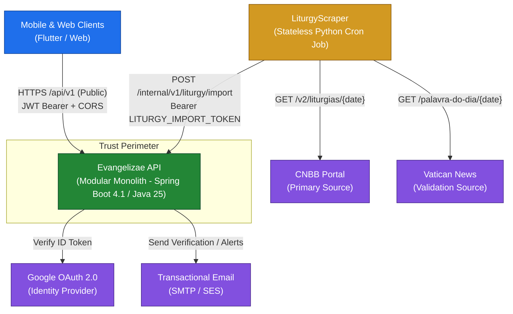
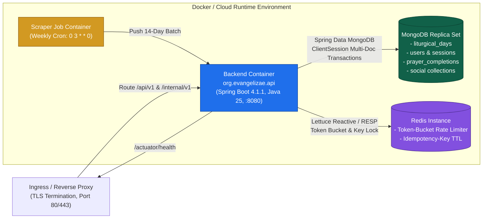
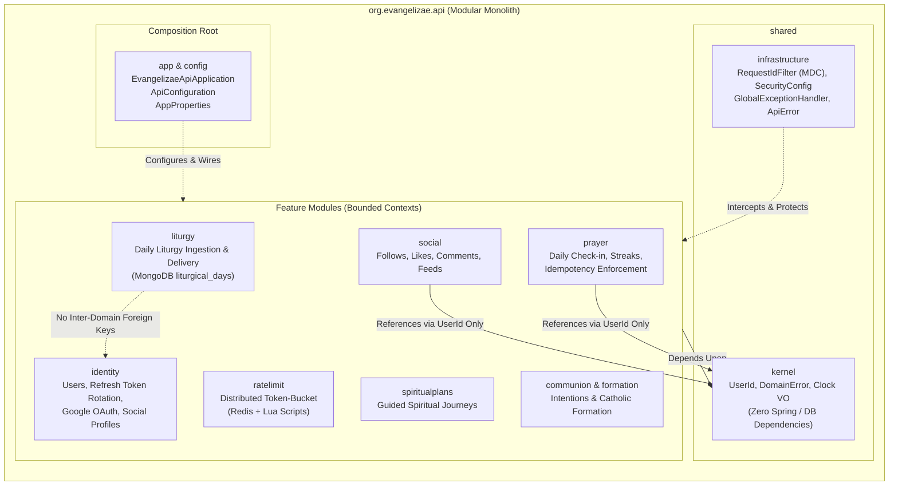
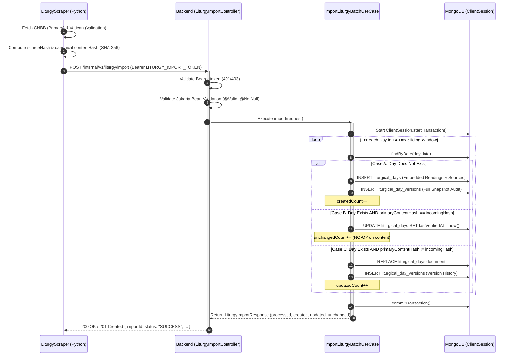
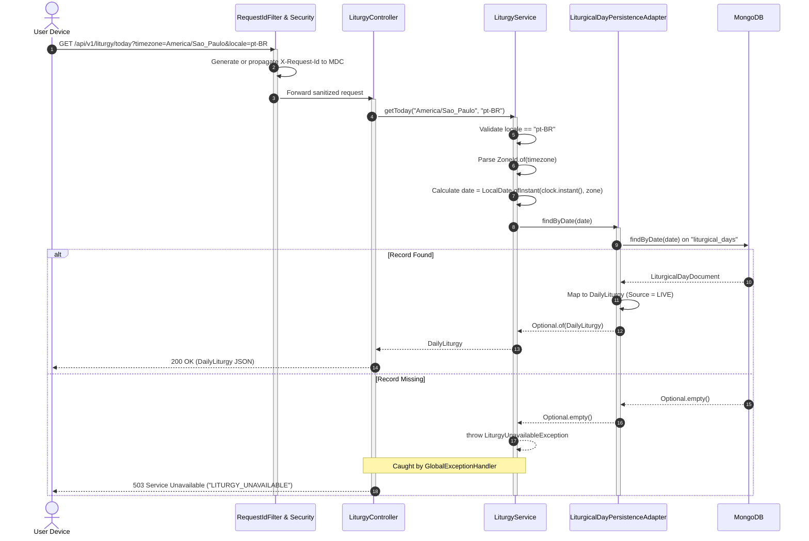
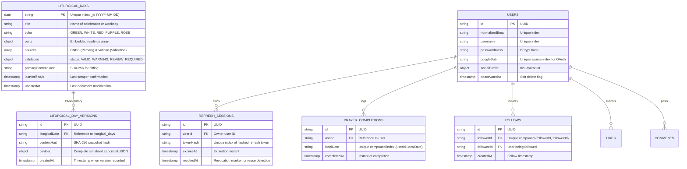
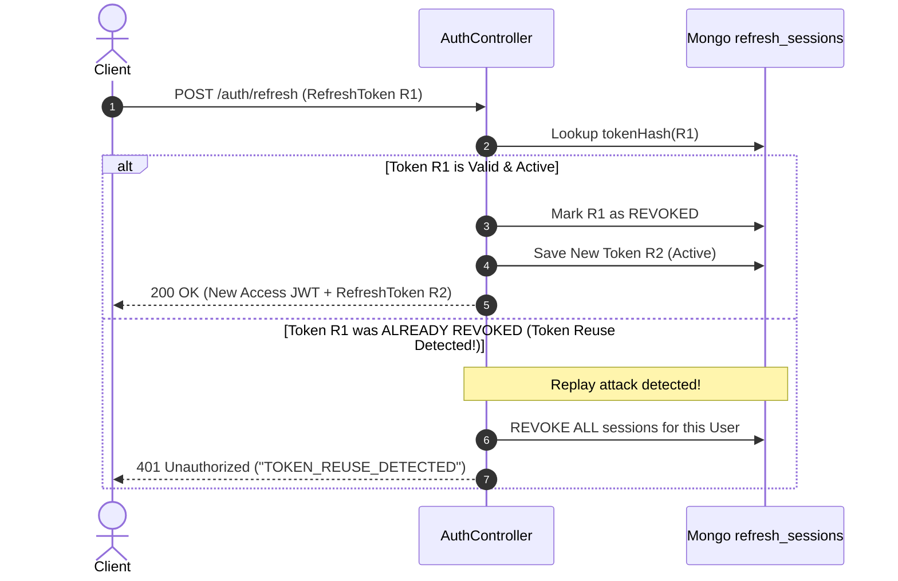

# Evangelizae API: Architecture & Engineering Master Guide
## The Comprehensive Guide to the System Architecture, Technical Decisions, and Package Anatomy

> **Version:** 1.0.0  
> **Status:** Authoritative Architectural Guide & System Manual  
> **Target Audience:** Core Engineers, Architects, and Technical Contributors  
> **Stack:** Java 25 | Spring Boot 4.1.1 | MongoDB Replica Set | Redis | Docker  

---

## Table of Contents

- [Preface: The System Vision & Mission](#preface-the-system-vision--mission)
- [Chapter 1: The Macro Architectural Philosophy](#chapter-1-the-macro-architectural-philosophy)
  - [1.1 The Modular Monolith Paradigm](#11-the-modular-monolith-paradigm)
  - [1.2 Hexagonal Architecture (Ports & Adapters)](#12-hexagonal-architecture-ports--adapters)
  - [1.3 Package-by-Feature vs. Package-by-Layer](#13-package-by-feature-vs-package-by-layer)
  - [1.4 The Storage Decision: Unified MongoDB](#14-the-storage-decision-unified-mongodb)
- [Chapter 2: Visual Architecture Atlas](#chapter-2-visual-architecture-atlas)
  - [2.1 System Context (C4 Level 1)](#21-system-context-c4-level-1)
  - [2.2 Container & Runtime Topology (C4 Level 2)](#22-container--runtime-topology-c4-level-2)
  - [2.3 Modular Monolith Component Graph (C4 Level 3)](#23-modular-monolith-component-graph-c4-level-3)
  - [2.4 Hexagonal Slice Anatomy](#24-hexagonal-slice-anatomy)
  - [2.5 Ingestion & Idempotent Upsert Pipeline](#25-ingestion--idempotent-upsert-pipeline)
  - [2.6 Public Read & Timezone Resolution Lifecycle](#26-public-read--timezone-resolution-lifecycle)
  - [2.7 Unified MongoDB Document Data Model](#27-unified-mongodb-document-data-model)
- [Chapter 3: The Autonomous Ingestion Subsystem](#chapter-3-the-autonomous-ingestion-subsystem)
  - [3.1 Separation of Concerns: Scraper vs. Backend](#31-separation-of-concerns-scraper-vs-backend)
  - [3.2 Authority Hierarchy: CNBB Primary vs. Vatican Validation](#32-authority-hierarchy-cnbb-primary-vs-vatican-validation)
  - [3.3 Cryptographic Content Hashing (SHA-256)](#33-cryptographic-content-hashing-sha-256)
  - [3.4 The 3-Way Reconciliation State Machine (Cases A, B, C)](#34-the-3-way-reconciliation-state-machine-cases-a-b-c)
  - [3.5 Multi-Document Transactionality via ClientSession](#35-multi-document-transactionality-via-clientsession)
- [Chapter 4: Exhaustive Package-by-Package Engineering Guide](#chapter-4-exhaustive-package-by-package-engineering-guide)
  - [4.1 Application Root & Composition (`org.evangelizae.api`, `app`, `config`)](#41-application-root--composition-orgevangelizaeapi-app-config)
  - [4.2 Cross-Cutting & Web Infrastructure (`shared`, `web`)](#42-cross-cutting--web-infrastructure-shared-web)
  - [4.3 The Liturgy Bounded Context (`org.evangelizae.api.liturgy`)](#43-the-liturgy-bounded-context-orgevangelizaeapiliturgy)
  - [4.4 Distributed Rate Limiting (`org.evangelizae.api.ratelimit`)](#44-distributed-rate-limiting-orgevangelizaeapiratelimit)
  - [4.5 Identity & Authentication Context (`org.evangelizae.api.identity`)](#45-identity--authentication-context-orgevangelizaeapiidentity)
  - [4.6 Prayer & Devotions Context (`org.evangelizae.api.prayer`)](#46-prayer--devotions-context-orgevangelizaeapiprayer)
  - [4.7 Social Context (`org.evangelizae.api.social`)](#47-social-context-orgevangelizaeapisocial)
  - [4.8 Spiritual Plans, Communion & Formation Contexts](#48-spiritual-plans-communion--formation-contexts)
- [Chapter 5: Temporal Invariants & The Liturgical Clock](#chapter-5-temporal-invariants--the-liturgical-clock)
  - [5.1 The Relativity of Liturgical Time](#51-the-relativity-of-liturgical-time)
  - [5.2 The Stale Cache Fallacy in Catholicism](#52-the-stale-cache-fallacy-in-catholicism)
  - [5.3 Strict IANA Timezone Validation](#53-strict-iana-timezone-validation)
  - [5.4 Deterministic Time Inversion with Clock Bean](#54-deterministic-time-inversion-with-clock-bean)
- [Chapter 6: Data Engineering & MongoDB Mechanics](#chapter-6-data-engineering--mongodb-mechanics)
  - [6.1 Collection Indexing & Constraint Strategy](#61-collection-indexing--constraint-strategy)
  - [6.2 The Document vs. Entity Mapper Pattern](#62-the-document-vs-entity-mapper-pattern)
  - [6.3 GDPR Cascading Deletion in a Single Transaction](#63-gdpr-cascading-deletion-in-a-single-transaction)
- [Chapter 7: Security, Authentication & Session Architecture](#chapter-7-security-authentication--session-architecture)
  - [7.1 Dual Security Perimeters (Internal vs. Public)](#71-dual-security-perimeters-internal-vs-public)
  - [7.2 Refresh Token Rotation with Reuse Detection](#72-refresh-token-rotation-with-reuse-detection)
  - [7.3 Google OAuth Federated Identity Verification](#73-google-oauth-federated-identity-verification)
- [Chapter 8: Cross-Cutting Engineering & Distributed Throttling](#chapter-8-cross-cutting-engineering--distributed-throttling)
  - [8.1 Distributed Token Bucket with Redis & Lua](#81-distributed-token-bucket-with-redis--lua)
  - [8.2 Distributed Request Tracing with MDC & Correlation IDs](#82-distributed-request-tracing-with-mdc--correlation-ids)
  - [8.3 Standardized RFC-7807 Error Model](#83-standardized-rfc-7807-error-model)
- [Chapter 9: Testing Strategy & Automated Architecture Verification](#chapter-9-testing-strategy--automated-architecture-verification)
  - [9.1 Testing Pyramid: Unit, Use Case, Testcontainers, and Contract](#91-testing-pyramid-unit-use-case-testcontainers-and-contract)
  - [9.2 ArchUnit Architectural Rules Enforcement](#92-archunit-architectural-rules-enforcement)
- [Chapter 10: Pull Request Checklist & Architectural Review Gate](#chapter-10-pull-request-checklist--architectural-review-gate)

---

## Preface: The System Vision & Mission

The **Evangelizae Backend API** is the core backend platform powering Evangelizae.com, a modern Catholic digital application designed to deliver daily liturgical readings, guide personal and communal prayer, foster spiritual devotions, and support user formation.

Unlike typical consumer content applications, a liturgical platform operates under strict theological and temporal constraints:
1. **Theological Infallibility of Content**: The backend must never generate, hallucinate, or alter Catholic scripture, liturgical prayers, or celebration data.
2. **Temporal Relativity**: A liturgical day is determined strictly by the local calendar day of the praying believer. Midnight in Tokyo or Rome occurs hours earlier than midnight in São Paulo. Serving content based on the server's UTC time would cause users in the Americas to see tomorrow's readings or users in Asia to see yesterday's.
3. **Absence Over Staleness**: If the system fails to verify today's liturgy, it must explicitly return `503 Service Unavailable` rather than serve yesterday's cached content under the guise of "today's liturgy". A Catholic user cannot pray yesterday's Mass readings today.
4. **Resilient Ingestion**: Web scrapers are fragile by nature due to external website redesigns. Ingestion must be decoupled from the client request-response lifecycle. Data is scraped ahead of time into a 14-day sliding window, validated, cryptographically hashed, and upserted into an immutable audit history.

To support these mission-critical constraints without unnecessary operational complexity, Evangelizae is designed as a **Modular Monolith** employing **Hexagonal Architecture (Ports and Adapters)**, built on **Java 25**, **Spring Boot 4.1.1**, **MongoDB**, and **Redis**.

---

## Chapter 1: The Macro Architectural Philosophy

```
+-------------------------------------------------------------------------------------------------------+
|                                    MACRO ARCHITECTURAL PARADIGM                                       |
+-------------------------------------------------------------------------------------------------------+
|  Modular Monolith   -> Zero distributed network latency; single CI/CD pipeline; unified deployment.   |
|  Hexagonal (Ports)  -> Pure domain core isolated from frameworks, databases, and network protocols.  |
|  Package-by-Feature -> Vertical feature ownership replaces horizontal technical layering.             |
|  Unified MongoDB    -> Single persistence engine for embedded readings and polymorphic social data.   |
|  Redis Throttling   -> Distributed token-bucket rate limiting and temporary idempotency key storage.  |
+-------------------------------------------------------------------------------------------------------+
```

### 1.1 The Modular Monolith Paradigm

Modern software engineering often defaults to microservices prematurely, incurring significant distributed systems penalties: network latency, distributed transaction complexities (2PC / Saga patterns), partial failure modes, complex distributed tracing, and heavy Kubernetes orchestration costs.

Evangelizae rejects premature microservices. Instead, it implements a **Modular Monolith**:
* **Single Deployment Unit**: A single executable JAR deployed in a container via [`Dockerfile`](file:///home/otavio/Work/EvangelizaeBackend/Dockerfile#L1-L15), running with low memory overhead.
* **Hard In-Process Boundaries**: Modules communicate strictly through strongly typed interfaces or pure domain value objects (such as `UserId`). No module is permitted to query another module's database tables or import internal entities.
* **Zero Distributed Transactions**: Multi-document operations across business contexts (e.g., GDPR cascading deletion of a user and their prayer completions) run inside a local database transaction without requiring complex distributed consensus.
* **Extraction-Ready Slices**: Because each module encapsulates its own domain, use cases, and persistence adapters, any module (such as `social` or `liturgy`) can be extracted into an independent microservice in the future with minimal refactoring.

### 1.2 Hexagonal Architecture (Ports & Adapters)

Within each module, the architecture enforces Alistair Cockburn's **Hexagonal Architecture** (Ports and Adapters). The driving goal is the **Dependency Inversion Principle**:

$$\text{Driving Adapters (In)} \longrightarrow \text{Application Use Cases} \longrightarrow \text{Domain Core} \longleftarrow \text{Driven Ports (Out)} \longleftarrow \text{Driven Adapters (Out)}$$

* **Domain Core**: Contains pure Java records, classes, and business invariants. It has **zero dependencies** on Spring Boot, Spring Data, MongoDB, Redis, Jackson, or any web framework.
* **Application Layer**: Contains use-case orchestrators (e.g., `GetTodayLiturgyUseCase`, `ImportLiturgyBatchUseCase`). It coordinates domain logic and communicates exclusively with output ports (interfaces).
* **Ports (Output Interfaces)**: Defined within the application or domain layer to declare what the use case needs (e.g., `LiturgicalDayRepository`, `TokenService`, `ClockPort`).
* **Adapters (Input/Driving)**: Controllers, filters, and event listeners that translate external protocols (HTTP REST, JSON) into use case calls.
* **Adapters (Output/Driven)**: Database repositories (Spring Data MongoDB), Redis clients, external API clients (Google OAuth), and mail senders that implement the output port interfaces.

> [!IMPORTANT]
> The domain layer must never import `org.springframework.*` or `org.springframework.data.mongodb.*`. All domain operations must be executable in pure unit tests without starting a Spring application context.

### 1.3 Package-by-Feature vs. Package-by-Layer

Traditional architectures organize code by technical role:
```text
// ANTI-PATTERN: Package-by-Layer (Horizontal Slice)
org.evangelizae.api
├── controllers/      // LiturgyController, AuthController, PrayerController, SocialController
├── services/         // LiturgyService, UserService, PrayerService, SocialService
├── repositories/     // LiturgyRepo, UserRepo, PrayerRepo, SocialRepo
└── models/           // LiturgyModel, UserModel, PrayerModel, SocialModel
```
This horizontal slicing couples unrelated business concepts, makes it difficult to trace a single feature, and obscures domain boundaries.

Evangelizae strictly implements **Package-by-Feature** (Vertical Slice):
```text
// CANONICAL: Package-by-Feature (Vertical Slice)
org.evangelizae.api
├── liturgy/          // Everything related to Catholic liturgy
├── identity/         // Everything related to authentication and user profiles
├── prayer/           // Everything related to daily prayers and streaks
├── social/           // Everything related to follows, likes, and comments
└── ratelimit/        // Everything related to distributed throttling
```
Each feature package contains its own internal `domain`, `application`, `ports`, and `adapters` subpackages. Engineers working on Liturgy touch only `org.evangelizae.api.liturgy.*` without risking regressions in `identity` or `social`.

### 1.4 The Storage Decision: Unified MongoDB

The system originally considered a hybrid persistence approach: PostgreSQL for relational liturgy tables and MongoDB for social interactions. The architecture decisively unified **all persistence on MongoDB**:

1. **Embedded Read Models**: Liturgical days are deeply hierarchical documents. A single day contains:
   - Celebration metadata (title, liturgical color, solemnity rank).
   - Season metadata (Advent, Lent, Ordinary Time, cycle A/B/C).
   - Liturgical parts (First Reading, Responsorial Psalm with refrain, Second Reading, Gospel, Acclamation, Sequence).
   - Verification metadata and sources (CNBB, Vatican News).  
   In PostgreSQL, reading a day requires joining 4 to 6 normalized tables. In MongoDB, the entire day is stored as a single document in `liturgical_days` and retrieved in a **single O(1) indexed lookup by date (`_id`)**.
2. **Polymorphic Social Data**: Reactions, prayers, intentions, and comments require flexible document structures. As new social features are introduced, MongoDB avoids costly DDL schema migrations.
3. **Elimination of Distributed State**: A hybrid setup requires managing two database engines, two connection pools, two backup strategies, and eliminates transactional boundaries across stores. With unified MongoDB, operations like account deletion run in a single atomic transaction.

---

## Chapter 2: Visual Architecture Atlas

### 2.1 System Context (C4 Level 1)



---

### 2.2 Container & Runtime Topology (C4 Level 2)



---

### 2.3 Modular Monolith Component Graph (C4 Level 3)



---

### 2.4 Hexagonal Slice Anatomy

```mermaid
flowchart LR
    subgraph DrivingAdapters["Driving Adapters (In)"]
        PublicCtrl["LiturgyController<br/>GET /api/v1/liturgy/today"]
        ImportCtrl["LiturgyImportController<br/>POST /internal/v1/liturgy/import"]
    end

    subgraph Hexagon["Hexagon Core (Isolated Domain)"]
        direction TB
        subgraph AppLayer["Application Layer"]
            GetTodayUC["GetTodayLiturgyUseCase"]
            ImportUC["ImportLiturgyBatchUseCase<br/>(@Transactional ClientSession)"]
        end
        subgraph DomainLayer["Domain Layer (Zero Framework Deps)"]
            DayEntity["LiturgicalDay"]
            ColorEnum["LiturgicalColor"]
            ReadingEntity["LiturgyReading<br/>(Invariant: text XOR options)"]
            DailyLiturgyVO["DailyLiturgy"]
        end
        subgraph OutPorts["Output Ports (Interfaces)"]
            DayRepoPort["LiturgicalDayRepository Port"]
            VersionRepoPort["LiturgyVersionRepository Port"]
            ClockPort["Clock Port"]
        end
    end

    subgraph DrivenAdapters["Driven Adapters (Out)"]
        MongoAdapter["LiturgicalDayPersistenceAdapter<br/>Spring Data MongoDB"]
        MongoDoc["LiturgicalDayDocument<br/>@Document('liturgical_days')"]
        SystemClock["Java Clock Adapter"]
    end

    PublicCtrl --> GetTodayUC
    ImportCtrl --> ImportUC
    GetTodayUC --> DomainLayer
    ImportUC --> DomainLayer
    GetTodayUC --> DayRepoPort
    ImportUC --> DayRepoPort
    ImportUC --> VersionRepoPort
    DayRepoPort <|.. MongoAdapter
    MongoAdapter --> MongoDoc
    ClockPort <|.. SystemClock
```

---

### 2.5 Ingestion & Idempotent Upsert Pipeline



---

### 2.6 Public Read & Timezone Resolution Lifecycle



---

### 2.7 Unified MongoDB Document Data Model



---

## Chapter 3: The Autonomous Ingestion Subsystem

The integration between the external **LiturgyScraper** and the **Evangelizae Core Backend** is governed by the formal contract documented in [`CONTRACT_SCRAPER.md`](file:///home/otavio/Work/EvangelizaeBackend/CONTRACT_SCRAPER.md#L1-L100).

### 3.1 Separation of Concerns: Scraper vs. Backend

```
+-------------------------------------------------------------+-------------------------------------------------------------+
|               LiturgyScraper (Python Job)                   |            Core Backend (Java / Spring Boot)                |
+-------------------------------------------------------------+-------------------------------------------------------------+
| - Runs via cron (0 3 * * 0).                                | - Runs permanently as an HTTP web service (:8080).          |
| - Stateless: holds no database connections.                 | - Owns the MongoDB database and collection schemas.         |
| - Collects raw HTML/JSON from external portals.             | - Authenticates scraper via Bearer LITURGY_IMPORT_TOKEN.     |
| - Normalizes biblical references and text whitespace.       | - Validates Jakarta Bean constraints on the batch payload.  |
| - Calculates SHA-256 hashes (sourceHash & contentHash).     | - Performs transactional 3-way hash diffing (upsert).       |
| - Pushes a sliding 14-day window via atomic POST.           | - Serves high-throughput read traffic to public clients.    |
+-------------------------------------------------------------+-------------------------------------------------------------+
```

### 3.2 Authority Hierarchy: CNBB Primary vs. Vatican Validation

Catholic liturgy in Brazil is legally and theologically governed by the **National Conference of Bishops of Brazil (CNBB)**:
1. **Primary Authority (`PRIMARY`)**: Edições CNBB (*Igreja em Oração*). The scraper treats CNBB as the absolute authority for liturgical texts, psalms, and prayers in Brazilian Portuguese.
2. **Validation Source (`VALIDATION`)**: Vatican News (*Palavra do Dia*). The scraper queries Vatican News to cross-verify biblical chapter and verse references (e.g., verifying that both sources read Matthew 5:1-12 on All Saints' Day).
3. **Discrepancy Handling**: If Vatican News is unavailable, down, or reports alternative memorial readings, the scraper tags the day with `status: "WARNING"` (`VATICAN_READINGS_UNAVAILABLE`) or `status: "REVIEW_REQUIRED"`, but **the backend persists the CNBB liturgy**. Liturgical data is never discarded because of a secondary source failure.

### 3.3 Cryptographic Content Hashing (SHA-256)

To guarantee idempotency and avoid unnecessary database writes, the ingestion contract establishes two distinct SHA-256 hashes:

1. **`sourceHash`**:
   $$\text{sourceHash} = \text{SHA-256}(\text{raw HTML / JSON payload from source})$$
   Used to detect whether the external provider modified its raw markup or template.
2. **`contentHash`**:
   $$\text{contentHash} = \text{SHA-256}(\text{Canonical JSON}(\text{domain\_fields}))$$
   Canonical JSON is computed with keys sorted alphabetically, without indentation, and using standard separators `(",", ":")`.
   * **Included Fields**: `date`, `celebration.name`, `celebration.type`, `celebration.liturgicalColor`, `liturgicalSeason`, and all readings (`type`, `reference`, `title`, `response`, `text`, `options`).
   * **Excluded Fields**: Operational and transient timestamps such as `scrapedAt`, `collectedAt`, `url`, and `scraperVersion`.

### 3.4 The 3-Way Reconciliation State Machine (Cases A, B, C)

When the backend receives a 14-day batch at `POST /internal/v1/liturgy/import`, the use case evaluates each day against the current database state:

```text
Incoming Day Document (Date D, Incoming primaryContentHash)
                      |
                      v
             Does D exist in DB?
            /                   \
        [NO]                     [YES]
         /                         \
+----------------------+     Compare DB.primaryContentHash == IncomingHash
|       CASE A         |                    /             \
| (Insert New Document)|              [EQUAL]             [DIFFERENT]
| - INSERT day         |                /                     \
| - INSERT version     |      +---------------------+   +---------------------+
| - createdCount++     |      |       CASE B        |   |       CASE C        |
+----------------------+      |  (Content Identical)|   |  (Content Altered)  |
                              | - NO-OP on content  |   | - REPLACE day doc   |
                              | - UPDATE            |   | - INSERT version    |
                              |   lastVerifiedAt    |   | - updatedCount++    |
                              | - unchangedCount++  |   +---------------------+
                              +---------------------+
```

* **Case A (New Insertion)**: First time seeing this calendar date. The day document is inserted into `liturgical_days`, and an immutable baseline version is recorded in `liturgical_day_versions`.
* **Case B (Unchanged NO-OP)**: The hash matches. The liturgical texts are strictly identical. The backend performs no content rewrite, preserving storage I/O and cache invalidation limits. It merely updates `lastVerifiedAt = now()` to record that the scraper re-validated the day.
* **Case C (Theological Revision)**: CNBB or the diocese revised a translation or celebration rank. The hash differs. The backend replaces the document in `liturgical_days`, records the previous and new version in `liturgical_day_versions`, and increments `updatedCount`.

### 3.5 Multi-Document Transactionality via ClientSession

In MongoDB 4.2+, transactions are supported over replica sets using `ClientSession`. The entire 14-day batch import executes inside a single `@Transactional` MongoDB session. If any day fails schema validation or database write constraints, the entire session aborts, preventing partial or corrupt liturgical ingestion states.

---

## Chapter 4: Exhaustive Package-by-Package Engineering Guide

This chapter walks through every package in `src/main/java/org/evangelizae/api`, explaining its role, architecture boundaries, and constituent classes.

```
src/main/java/org/evangelizae/api
├── EvangelizaeApiApplication.java
├── app/
├── config/
├── web/
├── shared/
│   ├── kernel/
│   └── infrastructure/
├── liturgy/
├── ratelimit/
├── identity/
├── prayer/
├── social/
├── spiritualplans/
├── communion/
└── formation/
```

---

### 4.1 Application Root & Composition (`org.evangelizae.api`, `app`, `config`)

#### Package: `org.evangelizae.api`
* [`EvangelizaeApiApplication.java`](file:///home/otavio/Work/EvangelizaeBackend/src/main/java/org/evangelizae/api/EvangelizaeApiApplication.java#L8-L12):
  * The main entry point. Annotated with `@SpringBootApplication` and `@ConfigurationPropertiesScan`.
  * Bootstraps the embedded Tomcat container on port 8080 (configured via `PORT` environment variable in [`application.yml`](file:///home/otavio/Work/EvangelizaeBackend/src/main/resources/application.yml#L16)).

#### Package: `org.evangelizae.api.app`
* [`package-info.java`](file:///home/otavio/Work/EvangelizaeBackend/src/main/java/org/evangelizae/api/app/package-info.java#L1-L4):
  * Serves as the **Application Composition Root**.
  * Contains zero business logic. Its sole purpose is cross-module wiring, registering Spring beans, configuring `MongoTransactionManager`, and orchestrating system startup hooks.

#### Package: `org.evangelizae.api.config`
* [`ApiConfiguration.java`](file:///home/otavio/Work/EvangelizaeBackend/src/main/java/org/evangelizae/api/config/ApiConfiguration.java#L10-L28):
  * **Clock Bean**: Exposes `Clock.systemUTC()` as an injectable Spring bean. Services needing the current instant inject `Clock` rather than calling `Instant.now()`.
  * **CORS Policy**: Configures `WebMvcConfigurer` to restrict browser origins using `app.cors.allowed-origins`, allowing only `GET` and `OPTIONS` on public endpoints with a 3600-second max age.
* [`AppProperties.java`](file:///home/otavio/Work/EvangelizaeBackend/src/main/java/org/evangelizae/api/config/AppProperties.java#L18-L46):
  * Immutable, validated configuration record mapping `app.*` properties:
    * `Cors`: Allowed frontend origins.
    * `Liturgy.Provider`: Legacy HTTP pull fallback settings (URL, timeouts).
    * `Liturgy.ImportConfig`: Contains the secret Bearer token (`token`) used to authenticate scraper imports (minimum 32 characters).
    * `RateLimit`: Redis token-bucket policies for both public reading and internal import endpoints.

---

### 4.2 Cross-Cutting & Web Infrastructure (`shared`, `web`)

#### Package: `org.evangelizae.api.shared.kernel`
* [`package-info.java`](file:///home/otavio/Work/EvangelizaeBackend/src/main/java/org/evangelizae/api/shared/kernel/package-info.java#L1-L4):
  * Contains pure Java primitives and value objects shared across business modules.
  * **Zero Framework Rule**: Must never import Spring, MongoDB, or third-party libraries.
  * Key abstractions:
    * `UserId`: Strongly-typed UUID wrapper preventing primitive obsession.
    * `DomainError`: Standard business exception root.

#### Package: `org.evangelizae.api.shared.infrastructure.web`
* [`RequestIdFilter.java`](file:///home/otavio/Work/EvangelizaeBackend/src/main/java/org/evangelizae/api/shared/infrastructure/web/RequestIdFilter.java#L20-L57):
  * Intercepts every incoming HTTP request with `Ordered.HIGHEST_PRECEDENCE`.
  * Extracts or generates an `X-Request-Id` correlation token.
  * Places the token into SLF4J's `MDC` under key `requestId`. All log messages automatically include the correlation ID.
  * Appends `X-Request-Id` to the HTTP response header for client-side issue reporting.

#### Package: `org.evangelizae.api.shared.infrastructure.security`
* [`SecurityConfig.java`](file:///home/otavio/Work/EvangelizaeBackend/src/main/java/org/evangelizae/api/shared/infrastructure/security/SecurityConfig.java#L11-L28):
  * Configures Spring Security with `SessionCreationPolicy.STATELESS`.
  * Disables CSRF, HTTP Basic, and Form Login.
  * Configures permit-all routing for public endpoints, leaving token authorization to custom filters.

#### Package: `org.evangelizae.api.shared.infrastructure.observability`
* [`package-info.java`](file:///home/otavio/Work/EvangelizaeBackend/src/main/java/org/evangelizae/api/shared/infrastructure/observability/package-info.java#L1-L3):
  * Custom Micrometer metrics: `liturgy.import.processed`, `liturgy.import.created`, `liturgy.import.updated`, and `liturgy.import.unchanged`.
  * Actuator health indicators configured for MongoDB and Redis probes in [`application.yml`](file:///home/otavio/Work/EvangelizaeBackend/src/main/resources/application.yml#L20-L36).

#### Package: `org.evangelizae.api.web`
* [`GlobalExceptionHandler.java`](file:///home/otavio/Work/EvangelizaeBackend/src/main/java/org/evangelizae/api/web/GlobalExceptionHandler.java#L15-L37):
  * Controller advice transforming uncaught domain exceptions into RFC-compliant JSON responses.
  * Maps [`LiturgyUnavailableException`](file:///home/otavio/Work/EvangelizaeBackend/src/main/java/org/evangelizae/api/liturgy/service/LiturgyUnavailableException.java#L3-L8) to `503 Service Unavailable`.
  * Maps [`InvalidLiturgyRequestException`](file:///home/otavio/Work/EvangelizaeBackend/src/main/java/org/evangelizae/api/liturgy/service/InvalidLiturgyRequestException.java#L3-L9) and parameter binding failures to `400 Bad Request`.
* [`ApiError.java`](file:///home/otavio/Work/EvangelizaeBackend/src/main/java/org/evangelizae/api/web/ApiError.java):
  * Standard error payload structure: `{ timestamp, status, error, code, message, path }`.
* [`HealthController.java`](file:///home/otavio/Work/EvangelizaeBackend/src/main/java/org/evangelizae/api/web/HealthController.java):
  * Lightweight application ping endpoint (`GET /api/v1/health`), returning status `UP`.

---

### 4.3 The Liturgy Bounded Context (`org.evangelizae.api.liturgy`)

The core business module of the application.

#### 1. `liturgy.domain` & `liturgy.model`
* [`LiturgicalColor.java`](file:///home/otavio/Work/EvangelizaeBackend/src/main/java/org/evangelizae/api/liturgy/model/LiturgicalColor.java#L3-L9):
  * Enum representing Catholic vestment colors: `GREEN`, `WHITE`, `RED`, `PURPLE`, `ROSE`.
* [`ReadingKind.java`](file:///home/otavio/Work/EvangelizaeBackend/src/main/java/org/evangelizae/api/liturgy/model/ReadingKind.java#L3-L9):
  * Enum classifying scriptures: `FIRST_READING`, `PSALM`, `SECOND_READING`, `GOSPEL`, `EXTRA`.
* [`LiturgyReading.java`](file:///home/otavio/Work/EvangelizaeBackend/src/main/java/org/evangelizae/api/liturgy/model/LiturgyReading.java#L3-L9):
  * Record representing an individual reading: title, biblical citation reference, body text, and responsorial psalm refrain.
* [`LiturgyGroup.java`](file:///home/otavio/Work/EvangelizaeBackend/src/main/java/org/evangelizae/api/liturgy/model/LiturgyGroup.java#L5-L10):
  * Groups readings by liturgical classification (`ReadingKind`).
* [`LiturgyPrayers.java`](file:///home/otavio/Work/EvangelizaeBackend/src/main/java/org/evangelizae/api/liturgy/model/LiturgyPrayers.java#L3-L9):
  * Collect, Prayer over the Offerings, and Prayer after Communion.
* [`LiturgySource.java`](file:///home/otavio/Work/EvangelizaeBackend/src/main/java/org/evangelizae/api/liturgy/model/LiturgySource.java#L5-L14):
  * Identifies provider name (`mongodb`), ingestion timestamp, and `Freshness` status (`LIVE` vs `CACHED`).
* [`DailyLiturgy.java`](file:///home/otavio/Work/EvangelizaeBackend/src/main/java/org/evangelizae/api/liturgy/model/DailyLiturgy.java#L6-L14):
  * The primary domain aggregate read model encapsulating the complete day.

#### 2. `liturgy.service` & `liturgy.application`
* [`LiturgyService.java`](file:///home/otavio/Work/EvangelizaeBackend/src/main/java/org/evangelizae/api/liturgy/service/LiturgyService.java#L13-L44):
  * Validates client query parameters (`locale == "pt-BR"`).
  * Parses IANA timezone string into a `ZoneId`.
  * Derives observer date via `LocalDate.ofInstant(clock.instant(), zone)`.
  * Queries the persistence adapter. Throws [`LiturgyUnavailableException`](file:///home/otavio/Work/EvangelizaeBackend/src/main/java/org/evangelizae/api/liturgy/service/LiturgyUnavailableException.java#L3-L8) if not found.
* [`LiturgyUnavailableException.java`](file:///home/otavio/Work/EvangelizaeBackend/src/main/java/org/evangelizae/api/liturgy/service/LiturgyUnavailableException.java#L3-L8) & [`InvalidLiturgyRequestException.java`](file:///home/otavio/Work/EvangelizaeBackend/src/main/java/org/evangelizae/api/liturgy/service/InvalidLiturgyRequestException.java#L3-L9):
  * Domain exceptions translated into HTTP 503 and HTTP 400.

#### 3. `liturgy.ports.out`
* Output port interfaces:
  * `LiturgicalDayRepository`: Port defining database retrieval and storage contracts.
  * `LiturgyVersionRepository`: Port defining audit snapshot persistence.

#### 4. `liturgy.adapters.out.mongodb`
* [`LiturgicalDayDocument.java`](file:///home/otavio/Work/EvangelizaeBackend/src/main/java/org/evangelizae/api/liturgy/adapters/out/mongodb/LiturgicalDayDocument.java#L11-L30):
  * Spring Data document annotated with `@Document("liturgical_days")`.
  * Stores embedded readings (`ReadingDocument`) and celebration details without relational joins.
* [`LiturgicalDayMongoRepository.java`](file:///home/otavio/Work/EvangelizaeBackend/src/main/java/org/evangelizae/api/liturgy/adapters/out/mongodb/LiturgicalDayMongoRepository.java#L8-L10):
  * Spring Data interface extending `MongoRepository<LiturgicalDayDocument, String>`.
  * Provides `Optional<LiturgicalDayDocument> findByDate(LocalDate date)`.
* [`LiturgicalDayPersistenceAdapter.java`](file:///home/otavio/Work/EvangelizaeBackend/src/main/java/org/evangelizae/api/liturgy/adapters/out/mongodb/LiturgicalDayPersistenceAdapter.java#L12-L44):
  * Implements the secondary port.
  * Converts the raw BSON document into the immutable domain record [`DailyLiturgy`](file:///home/otavio/Work/EvangelizaeBackend/src/main/java/org/evangelizae/api/liturgy/model/DailyLiturgy.java#L6-L14).

#### 5. `liturgy.adapters.in.web` & `liturgy.web`
* [`LiturgyController.java`](file:///home/otavio/Work/EvangelizaeBackend/src/main/java/org/evangelizae/api/liturgy/web/LiturgyController.java#L11-L28):
  * Public REST controller mapped to `GET /api/v1/liturgy/today`.
  * Validates query parameters and delegates to [`LiturgyService`](file:///home/otavio/Work/EvangelizaeBackend/src/main/java/org/evangelizae/api/liturgy/service/LiturgyService.java#L25-L33).
* **LiturgyImportController**:
  * Internal controller mapped to `POST /internal/v1/liturgy/import`.
  * Protected by secret token filter; triggers batch ingestion.

#### 6. `liturgy.provider` (Legacy Pull Fallback)
* [`HttpLiturgyProvider.java`](file:///home/otavio/Work/EvangelizaeBackend/src/main/java/org/evangelizae/api/liturgy/provider/HttpLiturgyProvider.java#L14-L40), [`LiturgyProvider.java`](file:///home/otavio/Work/EvangelizaeBackend/src/main/java/org/evangelizae/api/liturgy/provider/LiturgyProvider.java#L1-L10), and [`ProviderLiturgy.java`](file:///home/otavio/Work/EvangelizaeBackend/src/main/java/org/evangelizae/api/liturgy/provider/ProviderLiturgy.java#L1-L10):
  * Maintained strictly as an emergency migration fallback if the database has not yet been populated by the scraper. Deprecated once MongoDB ingestion stabilizes.

---

### 4.4 Distributed Rate Limiting (`org.evangelizae.api.ratelimit`)

Provides rate throttling backed by Redis to protect public endpoints and internal import APIs.

* **Domain** ([`ratelimit/domain`](file:///home/otavio/Work/EvangelizaeBackend/src/main/java/org/evangelizae/api/ratelimit/domain/package-info.java#L1-L3)):
  * Framework-free token bucket algorithms. Calculates token refill based on elapsed time:
    $$\text{Tokens Available} = \min(\text{Capacity}, \text{Previous Tokens} + \Delta t \times \text{Refill Rate})$$
* **Application** ([`ratelimit/application`](file:///home/otavio/Work/EvangelizaeBackend/src/main/java/org/evangelizae/api/ratelimit/application/package-info.java#L1-L3)):
  * Orchestrates rate checks using a client key (hashed IP address or authenticated `UserId`).
* **Adapters (In)** ([`ratelimit/adapters/in/web`](file:///home/otavio/Work/EvangelizaeBackend/src/main/java/org/evangelizae/api/ratelimit/adapters/in/web/package-info.java#L1-L3)):
  * Servlet filter intercepting requests before they reach the controllers. Injects standard RFC rate limit headers:
    * `X-RateLimit-Limit`
    * `X-RateLimit-Remaining`
    * `Retry-After` (when returning HTTP 429 Too Many Requests).
* **Adapters (Out)** ([`ratelimit/adapters/out/redis`](file:///home/otavio/Work/EvangelizaeBackend/src/main/java/org/evangelizae/api/ratelimit/adapters/out/redis/package-info.java#L1-L3)):
  * Implements the rate limiter port using a Redis Lua script. Lua scripts run atomically inside Redis, preventing race conditions under high concurrency.

---

### 4.5 Identity & Authentication Context (`org.evangelizae.api.identity`)

Governs user accounts, profile information, and authentication mechanisms ([`identity/package-info.java`](file:///home/otavio/Work/EvangelizaeBackend/src/main/java/org/evangelizae/api/identity/package-info.java#L1-L3)).

* **Domain Models**:
  * `User`: Root aggregate containing `id`, `normalizedEmail` (lowercased and trimmed), `username`, `passwordHash` (BCrypt), `googleSub` (OAuth subject identifier), and `socialProfile` (bio, avatarUrl).
  * `RefreshSession`: Maintains hashed refresh tokens, client IP, user-agent, creation instant, expiration instant, and revocation markers.
* **Key Application Use Cases**:
  * `RegisterUserUseCase`: Enforces unique email and password strength policies.
  * `LoginUserUseCase`: Verifies password hash and issues an access JWT (15-minute lifespan) and a refresh token (30-day lifespan).
  * `RefreshTokenUseCase`: Implements **Refresh Token Rotation**. When a refresh token is used, it is revoked, and a new token pair is issued. If a client attempts to use an already revoked token, the system flags a **Token Reuse Attack** and revokes all active sessions for that user.
  * `OAuthLoginUseCase`: Validates Google ID tokens and links external accounts by verified email.
  * `DeleteAccountUseCase`: Executes GDPR-compliant deletion across all MongoDB collections in a single transaction.

---

### 4.6 Prayer & Devotions Context (`org.evangelizae.api.prayer`)

Tracks individual prayer habits, daily rosaries, and devotional streaks ([`prayer/package-info.java`](file:///home/otavio/Work/EvangelizaeBackend/src/main/java/org/evangelizae/api/prayer/package-info.java#L1-L3)).

* **Domain Models & Invariants**:
  * `PrayerCompletion`: Represents a confirmed prayer event.
  * **Strict Uniqueness Rule**: A user can complete a given prayer type only once per local calendar day. Enforced via MongoDB compound unique index:
    ```javascript
    db.prayer_completions.createIndex({ "userId": 1, "localDate": 1 }, { unique: true })
    ```
  * `StreakCalculator`: Calculates continuous daily prayer streaks across calendar boundaries, taking user timezone transitions into account.
* **Application Use Cases**:
  * `CheckInPrayerUseCase`: Idempotent completion endpoint. Accepts an `Idempotency-Key` header stored in MongoDB collection `idempotency_keys` with a 48-hour TTL index. Duplicate requests return the original response without double-counting completions.

---

### 4.7 Social Context (`org.evangelizae.api.social`)

Manages spiritual connections, prayer intentions, and community interactions.

* **Domain Models**:
  * `Follow`: User-to-user following relationship, constrained by unique index `{ "followerId": 1, "followeeId": 1 }`.
  * `Like`: Polymorphic interaction model. Users can "like" or "amém" a prayer intention, reading commentary, or spiritual step via `(userId, targetType, targetId)`.
  * `Comment`: Threaded user discussions with moderation status.
* **Architecture Strategy**:
  * Relies on MongoDB's flexible schema. New interaction types (e.g., sharing a prayer intention or bookmarking a liturgical reading) can be introduced without relational database migrations.

---

### 4.8 Spiritual Plans, Communion & Formation Contexts

#### Spiritual Plans ([`spiritualplans/package-info.java`](file:///home/otavio/Work/EvangelizaeBackend/src/main/java/org/evangelizae/api/spiritualplans/package-info.java#L1-L3))
* Manages multi-day spiritual itineraries (e.g., 30 Days with St. Joseph, Lenten Devotionals).
* **Domain Invariant**: *A user may have at most one ACTIVE spiritual plan at any time*. Enforced via MongoDB partial unique index:
  ```javascript
  db.spiritual_plans.createIndex({ "userId": 1 }, { unique: true, partialFilterExpression: { status: "ACTIVE" } })
  ```

#### Communion ([`communion/package-info.java`](file:///home/otavio/Work/EvangelizaeBackend/src/main/java/org/evangelizae/api/communion/package-info.java#L1-L3))
* A moderated board for communal prayer intentions. Users post prayer intentions, and other community members commit to praying for them.

#### Formation ([`formation/package-info.java`](file:///home/otavio/Work/EvangelizaeBackend/src/main/java/org/evangelizae/api/formation/package-info.java#L1-L3))
* Educational Catholic content: Catechism articles, saint biographies, and liturgical commentary.

---

## Chapter 5: Temporal Invariants & The Liturgical Clock

### 5.1 The Relativity of Liturgical Time

A common software engineering pitfall is assuming that calendar dates can be computed using the server's UTC clock:
```java
// CRITICAL BUG: NEVER DO THIS IN A LITURGICAL SYSTEM
LocalDate today = LocalDate.now(); // Evaluates to server's local date (e.g., UTC)
```
Consider an observer in São Paulo (`UTC-03:00`) at 22:30 on August 24:
* In UTC, the current time is `01:30` on August 25.
* If the server uses UTC, it will serve August 25 readings (e.g., St. Louis) while the believer is praying at night on August 24 (St. Bartholomew).
* The Mass celebrated locally is for August 24. Serving August 25 is theological malpractice.

The correct derivation implemented in [`LiturgyService.java`](file:///home/otavio/Work/EvangelizaeBackend/src/main/java/org/evangelizae/api/liturgy/service/LiturgyService.java#L28) is:
```java
ZoneId zone = parseZone(timezone); // e.g., "America/Sao_Paulo"
LocalDate date = LocalDate.ofInstant(clock.instant(), zone);
```
The liturgical date is derived strictly from the observer's geographic timezone.

### 5.2 The Stale Cache Fallacy in Catholicism

In standard web applications, when a downstream service is unavailable, returning stale cached data is often acceptable. **In Catholic liturgy, returning stale data is a domain error.**

If the backend cannot find or verify the liturgical reading for the requested date, it must **never** fall back to returning yesterday's cached liturgy under a `LIVE` flag. A user opening their app on Easter Sunday must never be served the readings from Holy Saturday because the database query timed out.

As enforced in [`LiturgyService.java`](file:///home/otavio/Work/EvangelizaeBackend/src/main/java/org/evangelizae/api/liturgy/service/LiturgyService.java#L30-L33):
```java
return persistenceAdapter.findByDate(date)
        .orElseThrow(() -> new LiturgyUnavailableException(
                "A liturgia não está disponível para o dia de " + date));
```
If the requested date is missing, the system immediately raises [`LiturgyUnavailableException`](file:///home/otavio/Work/EvangelizaeBackend/src/main/java/org/evangelizae/api/liturgy/service/LiturgyUnavailableException.java#L3-L8), which translates to an HTTP `503 Service Unavailable` with code `LITURGY_UNAVAILABLE`.

### 5.3 Strict IANA Timezone Validation

To prevent injection attacks, date skew, or invalid timezone queries, [`LiturgyService.java`](file:///home/otavio/Work/EvangelizaeBackend/src/main/java/org/evangelizae/api/liturgy/service/LiturgyService.java#L35-L39) strictly parses client timezones using standard IANA identifiers:
```java
private ZoneId parseZone(String timeZone) {
    if (!StringUtils.hasText(timeZone)) {
        throw new InvalidLiturgyRequestException("timezone is required");
    }
    try { 
        return ZoneId.of(timeZone); 
    } catch (ZoneRulesException exception) { 
        throw new InvalidLiturgyRequestException("timezone must be a valid IANA timezone", exception); 
    }
}
```

### 5.4 Deterministic Time Inversion with Clock Bean

The application forbids calling `Instant.now()` or `LocalDate.now()` directly. Instead, [`ApiConfiguration.java`](file:///home/otavio/Work/EvangelizaeBackend/src/main/java/org/evangelizae/api/config/ApiConfiguration.java#L12-L13) provides an injectable `Clock` bean:
```java
@Bean
Clock clock() { 
    return Clock.systemUTC(); 
}
```
In automated unit and integration tests, this allows tests to inject a fixed clock:
```java
Clock fixedClock = Clock.fixed(Instant.parse("2026-08-24T23:30:00Z"), ZoneOffset.UTC);
LiturgyService service = new LiturgyService(adapter, fixedClock);
```
This enables deterministic verification of midnight rollover and timezone transitions without thread sleeping or monkey patching.

---

## Chapter 6: Data Engineering & MongoDB Mechanics

### 6.1 Collection Indexing & Constraint Strategy

MongoDB operates with specific indexing strategies to guarantee sub-millisecond query performance and enforce domain uniqueness invariants:

| Collection | Key Pattern | Type | Architectural Purpose |
| :--- | :--- | :--- | :--- |
| `liturgical_days` | `{ "date": 1 }` | Unique | Calendar day lookup (`_id` is date string `YYYY-MM-DD`). |
| `liturgical_day_versions` | `{ "liturgicalDate": 1, "createdAt": -1 }` | Compound | Fast historical audit lookups ordered by creation date. |
| `users` | `{ "normalizedEmail": 1 }` | Unique | Prevents duplicate user accounts regardless of case/spacing. |
| `users` | `{ "googleSub": 1 }` | Unique Sparse | Fast federated OAuth lookup for users authenticated via Google. |
| `refresh_sessions` | `{ "tokenHash": 1 }` | Unique | Secure lookup of hashed refresh tokens during token rotation. |
| `refresh_sessions` | `{ "userId": 1, "expiresAt": 1 }` | Compound | Session lifecycle lookups and cleanup queries. |
| `prayer_completions` | `{ "userId": 1, "localDate": 1 }` | Unique | Enforces the invariant: one completion per user per calendar day. |
| `follows` | `{ "followerId": 1, "followeeId": 1 }` | Unique | Prevents duplicate follower relationships. |
| `likes` | `{ "userId": 1, "targetType": 1, "targetId": 1 }` | Unique | Prevents duplicate likes on the same item. |
| `idempotency_keys` | `{ "expiresAt": 1 }` | TTL | Automatically removes processed idempotency keys after 48 hours. |

### 6.2 The Document vs. Entity Mapper Pattern

A core hexagonal principle enforced in this architecture: **The persistence document is never the domain model**.

* **Anti-Pattern**: Annotating domain entities directly with Spring Data annotations (`@Document`, `@Id`, `@Field`). This leaks MongoDB dependencies into the domain layer.
* **Canonical Architecture**:
  1. [`DailyLiturgy.java`](file:///home/otavio/Work/EvangelizaeBackend/src/main/java/org/evangelizae/api/liturgy/model/DailyLiturgy.java#L6-L14) is a pure Java domain record.
  2. [`LiturgicalDayDocument.java`](file:///home/otavio/Work/EvangelizaeBackend/src/main/java/org/evangelizae/api/liturgy/adapters/out/mongodb/LiturgicalDayDocument.java#L11-L30) is the Spring Data persistence document.
  3. [`LiturgicalDayPersistenceAdapter.java`](file:///home/otavio/Work/EvangelizaeBackend/src/main/java/org/evangelizae/api/liturgy/adapters/out/mongodb/LiturgicalDayPersistenceAdapter.java#L26-L42) acts as the anti-corruption mapper translating between the two.

```java
// Mapping Document -> Domain Model
private DailyLiturgy toDailyLiturgy(LiturgicalDayDocument document) {
    var readings = document.readings().stream()
            .map(r -> new LiturgyReading(r.title(), r.reference(), r.text(), r.refrain()))
            .toList();

    var group = new LiturgyGroup(ReadingKind.valueOf(document.readings().getFirst().kind()), readings);
    
    return new DailyLiturgy(
            document.date(),
            document.title(),
            LiturgicalColor.valueOf(document.color()),
            new LiturgyPrayers(null, null, null),
            List.of(group),
            new LiturgySource("mongodb", Instant.now(), LiturgySource.Freshness.LIVE)
    );
}
```

### 6.3 GDPR Cascading Deletion in a Single Transaction

When a user requests account deletion under GDPR / LGPD privacy laws, the system must purge all personal data across multiple collections.

Because all domains reside in MongoDB, this operation executes inside a single `ClientSession` transaction:
```java
@Transactional
public void deleteUserAccount(UserId userId) {
    // 1. Delete user profile and authentication credentials
    userRepository.deleteById(userId);
    // 2. Revoke all active refresh sessions
    refreshSessionRepository.deleteByUserId(userId);
    // 3. Purge personal prayer completion records
    prayerRepository.deleteByUserId(userId);
    // 4. Remove all user follow relationships
    followRepository.deleteByFollowerOrFollowee(userId);
    // 5. Remove likes and comments
    interactionRepository.deleteByUserId(userId);
}
```
If any deletion step fails, the entire transaction rolls back, preventing orphaned data records.

---

## Chapter 7: Security, Authentication & Session Architecture

### 7.1 Dual Security Perimeters (Internal vs. Public)

The application enforces two distinct security boundaries:

```
                  +-----------------------------------------------+
                  |                SECURITY GATEWAY               |
                  +-----------------------------------------------+
                                 /                 \
                     [Path: /internal/**]    [Path: /api/**]
                               /                     \
        +----------------------------+  +----------------------------+
        |  Internal Ingestion Chain  |  |    Public API Chain        |
        | - LiturgyScraper traffic   |  | - Mobile / Web clients     |
        | - Bearer LITURGY_IMPORT_   |  | - Short-lived JWT Bearer   |
        |   TOKEN check              |  | - Refresh Token Rotation   |
        | - Rate limit: 5 req/min    |  | - Rate limit: 30 req/sec   |
        | - Returns 401/403 directly |  | - Strict CORS allowlist    |
        +----------------------------+  +----------------------------+
```

1. **Internal Ingestion Chain (`/internal/**`)**:
   * Accessible only by the autonomous Python scraper.
   * Gated by a static secret Bearer token (`LITURGY_IMPORT_TOKEN`) configured in [`AppProperties.java`](file:///home/otavio/Work/EvangelizaeBackend/src/main/java/org/evangelizae/api/config/AppProperties.java#L32-L34).
   * Missing or invalid tokens return immediate `401 Unauthorized` or `403 Forbidden` responses before hitting any controller or database logic.
2. **Public Client Chain (`/api/**`)**:
   * Accessible by mobile and web applications.
   * Authenticated via short-lived asymmetric JWT access tokens (15-minute validity).
   * Cross-Origin Resource Sharing (CORS) strictly configured via [`ApiConfiguration.java`](file:///home/otavio/Work/EvangelizaeBackend/src/main/java/org/evangelizae/api/config/ApiConfiguration.java#L16-L27) to allow only verified frontend origins.

### 7.2 Refresh Token Rotation with Reuse Detection

To prevent token theft and replay attacks, Evangelizae implements **Refresh Token Rotation (RTR)**:



### 7.3 Google OAuth Federated Identity Verification

When users sign in using Google:
1. The client SDK acquires a Google ID Token (`JWT`).
2. The client transmits the token to `POST /api/v1/auth/oauth/google`.
3. The backend validates the cryptographic signature against Google's public JWKS keys and verifies that `aud` matches `GOOGLE_CLIENT_ID`.
4. If valid, the backend extracts the verified email address and subject identifier (`googleSub`).
5. The user is linked to an existing account with that verified email or a new user is created, preventing account duplication across login methods.

---

## Chapter 8: Cross-Cutting Engineering & Distributed Throttling

### 8.1 Distributed Token Bucket with Redis & Lua

To protect backend resources against denial-of-service attacks and scraper flooding, the application implements distributed rate limiting using Redis:

* **Why Lua Scripts?** Under high concurrency, checking available tokens and updating the count in separate Redis commands causes race conditions. A Lua script executes atomically within Redis, ensuring thread-safe token accounting.
* **Token Refill Dynamics**:
  * Public Liturgy Read: Capacity = 30 tokens, Refill Rate = 1 token/second.
  * Scraper Ingestion: Capacity = 5 tokens, Refill Rate = 1 token/minute.

### 8.2 Distributed Request Tracing with MDC & Correlation IDs

Every inbound request flows through [`RequestIdFilter.java`](file:///home/otavio/Work/EvangelizaeBackend/src/main/java/org/evangelizae/api/shared/infrastructure/web/RequestIdFilter.java#L22-L57):

1. Inspects the incoming HTTP header `X-Request-Id`.
2. Validates that the ID matches `^[A-Za-z0-9._-]{1,100}$` (sanitizing against CRLF log injection attacks).
3. If missing, generates a new UUID.
4. Binds the ID to SLF4J's `MDC`:
   ```java
   try (MDC.MDCCloseable ignored = MDC.putCloseable(MDC_KEY, requestId)) {
       filterChain.doFilter(request, response);
   }
   ```
5. All logs generated during request execution automatically include `[requestId=...]`, allowing distributed log aggregation systems (Datadog, Loki, CloudWatch) to trace an entire request lifecycle with a single query.

### 8.3 Standardized RFC-7807 Error Model

All error responses adhere to the standard format defined in [`ApiError.java`](file:///home/otavio/Work/EvangelizaeBackend/src/main/java/org/evangelizae/api/web/ApiError.java):

```json
{
  "timestamp": "2026-08-24T22:30:15.123Z",
  "status": 503,
  "error": "Service Unavailable",
  "code": "LITURGY_UNAVAILABLE",
  "message": "A liturgia não está disponível para o dia de 2026-08-24",
  "path": "/api/v1/liturgy/today"
}
```

This predictable contract allows frontend client libraries to provide localized, user-friendly error banners and retry mechanisms.

---

## Chapter 9: Testing Strategy & Automated Architecture Verification

### 9.1 Testing Pyramid: Unit, Use Case, Testcontainers, and Contract

The codebase enforces a multi-tiered testing strategy:

```
          / \
         /   \       Contract / MockMvc Tests (HTTP status, OpenAPI compliance)
        /     \      ---------------------------------------------------------
       /       \     Adapter Tests (Testcontainers MongoDB, unique index violations)
      /         \    ----------------------------------------------------------------
     /           \   Application Use Case Tests (Fake repository ports, edge conditions)
    /             \  --------------------------------------------------------------------
   /               \ Pure Domain Unit Tests (Reading invariants, color enums, streak math)
  /_________________\
```

1. **Domain Unit Tests**: Sub-millisecond execution. Tests domain invariants (e.g., verifying that a `LiturgyReading` throws an exception if both `text` and `options` are non-null).
2. **Use Case Tests**: Uses in-memory fake repositories to verify business flow (e.g., verifying Cases A, B, and C during scraper batch import).
3. **Adapter Tests**: Uses **Testcontainers MongoDB** to spin up an ephemeral MongoDB replica set during integration tests, validating unique compound indexes, multi-document transactions, and BSON serialization.
4. **Contract Tests**: Uses `@AutoConfigureMockMvc` (as seen in [`LiturgyControllerTest.java`](file:///home/otavio/Work/EvangelizaeBackend/src/test/java/org/evangelizae/api/liturgy/web/LiturgyControllerTest.java#L14-L52)) to verify HTTP response status codes, header propagation, and JSON field names against the OpenAPI specification.

### 9.2 ArchUnit Architectural Rules Enforcement

To ensure architectural discipline and prevent architectural erosion over time, the project includes **ArchUnit** tests in its test suite:

```java
@Test
void domainMustNotDependOnSpringOrMongoDB() {
    noClasses()
        .that().resideInAPackage("..domain..")
        .should().dependOnClassesThat().resideInAnyPackage(
            "org.springframework..",
            "org.springframework.data.mongodb..",
            "io.jsonwebtoken..",
            "com.google.."
        )
        .check(importedClasses);
}
```
If an engineer accidentally introduces a Spring annotation (e.g., `@Autowired` or `@Component`) into a domain model, the automated test build fails immediately.

---

## Chapter 10: Pull Request Checklist & Architectural Review Gate

Before any pull request is merged into the codebase, verify that all changes comply with this architectural checklist:

- [ ] **Domain Purity**: Does the `domain` package remain 100% free of Spring, MongoDB, Redis, and JWT imports?
- [ ] **Controller Thinness**: Are controllers strictly responsible for HTTP binding, delegating all coordination to application use cases?
- [ ] **Explicit Mapping**: Are Spring Data MongoDB `@Document` classes kept completely separate from domain entities and converted via explicit mappers?
- [ ] **Temporal Determinism**: Is time retrieved exclusively from the injected `Clock` bean rather than static system clock calls (`Instant.now()`, `new Date()`)?
- [ ] **Liturgical Invariants**: Does reading processing respect the `text XOR options` invariant? Is stale liturgy rejected instead of served as `LIVE`?
- [ ] **Database Constraints**: Are all uniqueness constraints backed by database indexes (`date` for liturgy, `userId + localDate` for prayer, `followerId + followeeId` for follows)?
- [ ] **Security Boundaries**: Does internal ingestion (`/internal/**`) require the Bearer `LITURGY_IMPORT_TOKEN`, while public endpoints use JWT authentication?
- [ ] **Audit Preservation**: Does modifying a liturgical day append an audit snapshot to `liturgical_day_versions` within the same transaction?
- [ ] **Test Coverage**: Are new features covered by pure unit tests for domain logic and Testcontainers MongoDB tests for persistence operations?
